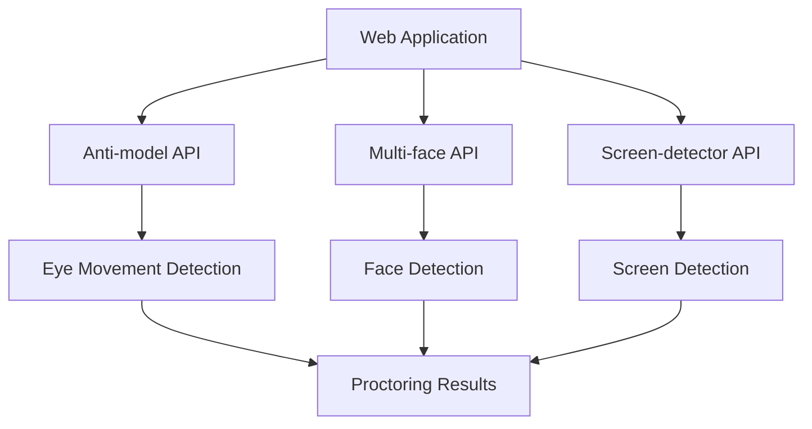
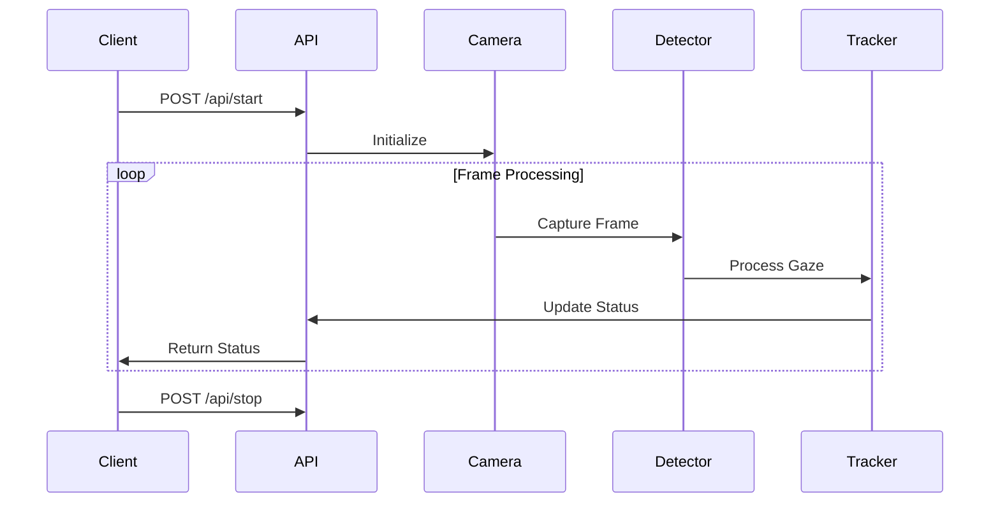
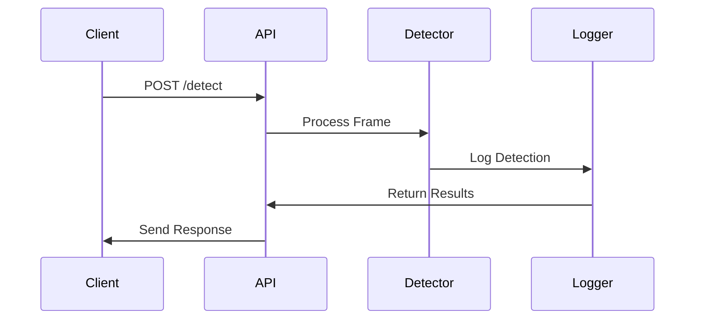
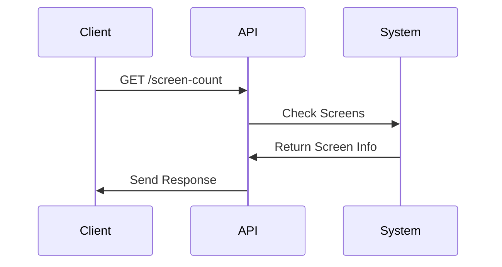
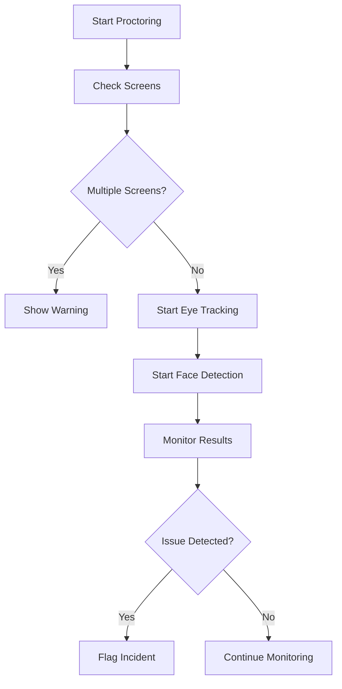

# Online Proctoring System Documentation

## Overview

This documentation describes a comprehensive online proctoring system consisting of three main components:

1. **Eye Movement Tracking (Anti-model)**
2. **Multiple Face Detection (Multi-face)**
3. **Screen Detection (Screen-detector)**

These components work together to create a robust online proctoring solution for interviews and examinations.

## System Architecture

## Component Details

### 1. Eye Movement Tracking (Anti-model)

#### Flowchart

#### Key Features:
- Real-time eye movement detection
- Gaze direction tracking (left, right, center, up, down)
- Off-screen time ratio calculation
- Suspicious behavior flagging
- Calibration system

#### API Endpoints:
- `/api/start` - Start eye tracking
- `/api/stop` - Stop eye tracking
- `/api/status` - Get current tracking status
- `/api/raw_data` - Get detailed tracking data
- `/api/frame` - Get current webcam frame
- `/api/start_calibration` - Start calibration
- `/api/reset_calibration` - Reset calibration
- `/api/settings` - Configure system settings

### 2. Multiple Face Detection (Multi-face)

#### Flowchart

#### Key Features:
- Real-time face detection using MediaPipe
- Multiple face detection and tracking
- Cheating detection (multiple people in frame)
- Annotated frame output
- Automatic logging of detection events

#### API Endpoints:
- `/detect` - Detect faces in uploaded image
- Returns:
  - Number of faces
  - Multiple people flag
  - Cheating detection status
  - Annotated frame
  - Timestamp

### 3. Screen Detection (Screen-detector)

#### Flowchart

#### Key Features:
- Detects number of connected screens
- Provides warnings for multiple monitors
- Simple REST API interface

#### API Endpoints:
- `/screen-count` - Get number of connected screens
- Returns:
  - Screen count
  - Warning message (if multiple monitors)

## Integration Flow

## Usage Example

1. **Initial Setup**
   - Start all three API servers
   - Configure web application to connect to APIs

2. **Pre-interview Checks**
   - Check for multiple screens
   - Verify single person in frame
   - Calibrate eye tracking

3. **During Interview**
   - Monitor eye movements
   - Track face presence
   - Detect multiple people
   - Flag suspicious behavior

4. **Post-interview**
   - Generate proctoring report
   - Review flagged incidents
   - Export detection logs

## Technical Requirements

### Hardware
- Webcam
- Single monitor (recommended)
- Stable internet connection

### Software
- Python 3.8+
- OpenCV
- MediaPipe
- Flask/FastAPI
- Docker (optional)

## Security Considerations

1. **Data Privacy**
   - Video frames processed locally
   - No permanent storage of video data
   - Logs contain only detection results

2. **Access Control**
   - CORS enabled for web integration
   - Configurable host and port settings
   - Secure API endpoints

3. **System Security**
   - Docker containerization
   - Privileged access for webcam
   - Automatic restart capability

## Troubleshooting

1. **Camera Issues**
   - Check webcam permissions
   - Verify camera initialization
   - Test with different resolutions

2. **Detection Problems**
   - Ensure proper lighting
   - Check face visibility
   - Verify calibration

3. **Performance Issues**
   - Monitor system resources
   - Adjust frame processing rate
   - Check network latency

## Future Enhancements

1. **Planned Features**
   - Audio detection
   - Screen sharing detection
   - Mobile device detection
   - AI-powered behavior analysis

2. **Improvements**
   - Enhanced accuracy
   - Reduced latency
   - Better calibration
   - More detailed reporting 